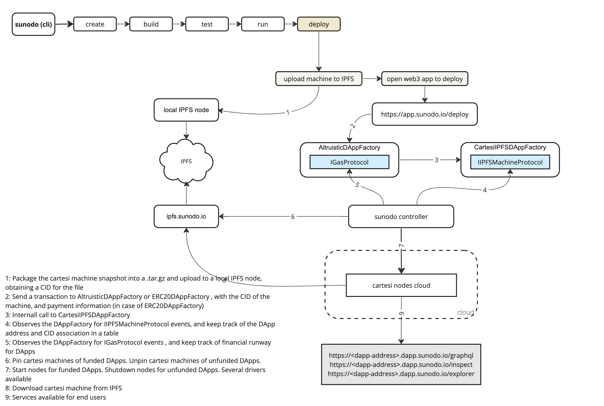

# Sunodo

Sunodo is a hosting service for decentralized applications written using [Cartesi](http://cartesi.io) technology.

If applications are decentralized why do they need hosting?

Cartesi decentralized applications (DApps) are [application specific rollups](https://medium.com/cartesi/application-specific-rollups-e12ed5d9de01) that runs offchain and uses the blockchain as a consensus mechanism and dispute resolution. As such it needs to have nodes running that performs validation of the application computations (validator nodes), and also indexing services to serve the state of the application (reader nodes).

Sunodo provide an easy way to deploy those nodes.

## What's inside?

This monorepo ([turborepo](https://turbo.build/repo)) includes libraries and applications for the upper part of the architecture diagram below.



### Apps and Packages

-   `api`: a [fastify](https://www.fastify.io) REST API for deployment and management of DApps, deployed at [https://api.sunodo.io](https://api.sunodo.io);
-   `cli`: a [oclif](https://oclif.io) CLI tool for deployment and management of DApps, available at `brew install sunodo`;
-   `docs`: a [docusaurus](https://docusaurus.io) app with Sunodo documentation, deployed at [https://docs.sunodo.io](https://docs.sunodo.io)
-   `web`: a [next.js](https://nextjs.org/) app for Sunodo website, deployed at [https://sunodo.io](https://sunodo.io)
-   `app`: a [next.js](https://nextjs.org/) app for Sunodo dashboard, deployed at [https://app.sunodo.io](https://app.sunodo.io)
-   `ui`: a stub React component library shared by both `web` and `app` applications
-   `eslint-config-custom`: `eslint` configurations (includes `eslint-config-next` and `eslint-config-prettier`)
-   `tsconfig`: `tsconfig.json`s used throughout the monorepo

Each package/app is 100% [TypeScript](https://www.typescriptlang.org/).

### Utilities

This turborepo has some additional tools already setup for you:

-   [TypeScript](https://www.typescriptlang.org/) for static type checking
-   [ESLint](https://eslint.org/) for code linting
-   [Prettier](https://prettier.io) for code formatting

### Build

To build all apps and packages, run the following command:

```shell
cd sunodo
yarn run build
```

### Develop

To develop all apps and packages, run the following command:

```shell
cd sunodo
yarn run dev
```
