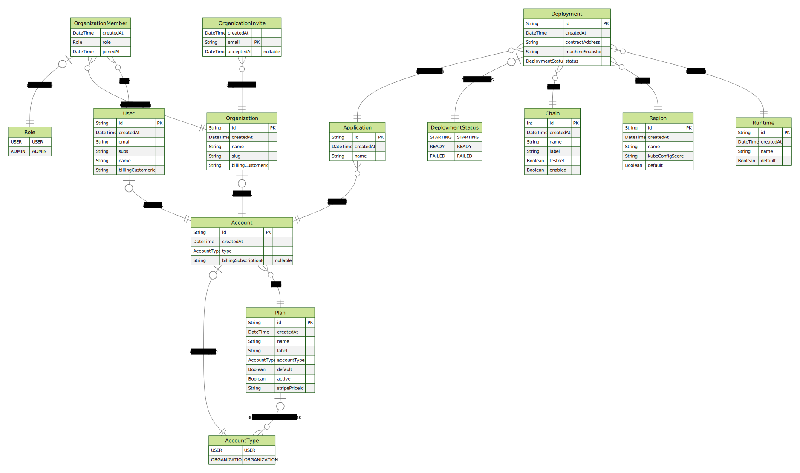
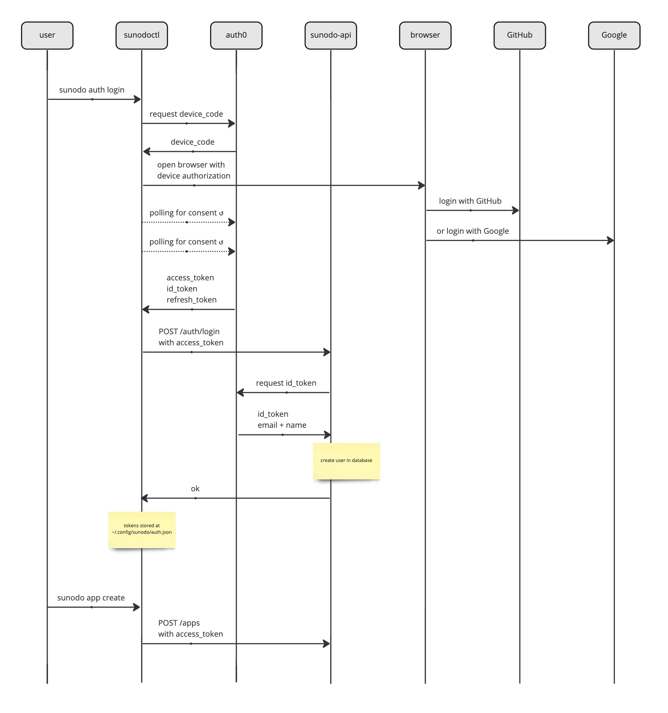

# Sunodo API

This implements a REST API for deployment and management of Cartesi DApps. It uses typescript and the [fastify](https://fastify.io) web framework.

The API does not take a design first approach, but rather a code first approach. All the routes and schemas are defined in the code, and an [OpenAPI](https://www.openapis.org) is automatically generate from that.

Request and response schemas are defined using the [TypeBox](https://github.com/sinclairzx81/typebox) library, and automatically validated by [@fastify/type-provider-typebox](https://github.com/fastify/fastify-type-provider-typebox).

## Database

The API stores data using a postgres database. The developer must have [postgres installed](https://www.postgresql.org/download/) locally to run the application locally.

The schema of the database is defined using [Prisma](https://www.prisma.io), which also provides a nice TypeScript ORM, and tooling for managing the database.

One of the possibilities of Prisma is to generate an ERD diagram of the schema by running the following command.

```shell
npx prisma generate
```



For documentation on how to use Prisma CLI refer to their [docs](https://www.prisma.io/docs/reference/api-reference/command-reference).

## Authentication

The API does not handle authentication of users, it handles authorization through OAuth and [OpenID Connect](https://openid.net/connect/). The authenticated methods of the API require a JWT access token in the `Authorization` HTTP Header as a `Bearer` token, which is then used to request an id token from the identity provider.

The identity provider currently used is [Auth0](https://auth0.com). There are two configured Auth0 tenants, one for development, and another for production, the last one configured with a custom domain mapping at [https://auth.sunodo.io](https://auth.sunodo.io).

The Auth0 applications are configured to use social login with two providers: GitHub and Google. So in a nutshell Sunodo allows users to login with their GitHub or Google credentials, and those are the only two planned options for now.

The CLI application uses the [device authorization flow](https://auth0.com/docs/get-started/authentication-and-authorization-flow/device-authorization-flow), which is safe and recommended for native CLI applications.

The diagram below illustrates the authentication workflow between the sunodo CLI and the sunodo API.



## Running

1. [install postgres](https://www.postgresql.org/download/)
2. create a database called `sunodo`
3. `yarn` to install dependencies
4. `npx prisma db push`
5. `yarn dev`

```shell
Server ready at http://0.0.0.0:3001
```

OpenAPI browser will be available at `http://localhost:3001/docs/`
