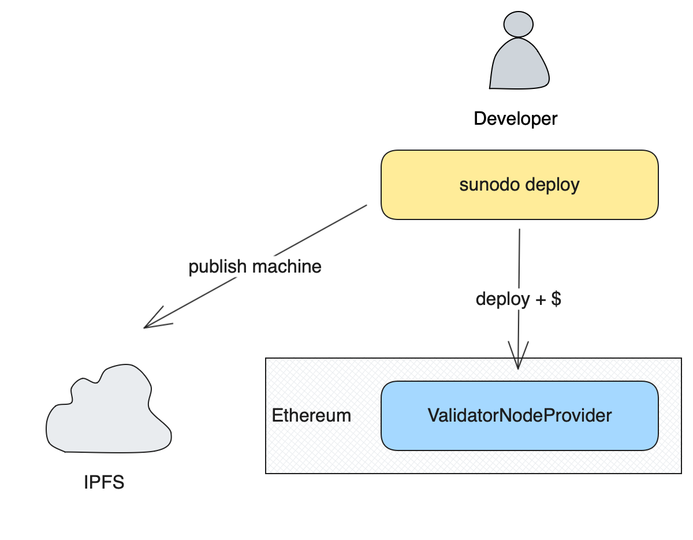

# Deploying application

::: warning
This is still under development and will be available in a future release.
:::

The deployment of an application is done in two basic steps:

1. Upload of the application Cartesi machine to IPFS;
2. Registration of the application on-chain;

The process is illustrated below:



## Cartesi machine upload

The first step in the deployment process is to make the application Cartesi machine publicly available so the validator can download it and run the application node. Sunodo uses IPFS as a decentralized storage for the Cartesi machine.

Initially the developer must run his own IPFS node and add the Cartesi machine to it. Any IPFS client works fine, including [IPFS Desktop](https://docs.ipfs.tech/install/ipfs-desktop/).

Technically the machine is packaged as a [CAR file](https://car.ipfs.io), which is a content-addressable archive. When the developer adds the file to IPFS it gets back a `CID` hash. Different machines produce different IPFS CID hashes.

With the CID in hand the developer can register his application on-chain.

## Application registration

After obtaining the CID of the Cartesi machine the developer must select a `ValidatorNodeProvider` and call the `deploy` function, which requires four parameters:

-   `owner`: the owner of the deployed application, which has the power to switch the validator;
-   `templateHash`: the Cartesi machine template hash, obtained after `sunodo build`;
-   `location`: the IPFS CID hash of the Cartesi machine uploaded to IPFS;
-   `initialRunway`: the amount of time to pre-pay for application execution;

Depending on the `initialRunway` parameter the developer must `approve` a certain amount of tokens of the ERC-20 contract of the `ValidatorNodeProvider` to the `payee` of the `ValidatorNodeProvider`.

The amount of tokens can be calculated using the `cost` view function of the `ValidatorNodeProvider`. For further details check the [billing](./billing.md) section.

## Using the CLI

The command below will guide the developer through an interactive process to deploy the application, including all the steps described above.

```shell
sunodo deploy
```

The following wallets are currently supported for signing the necessary on-chain transactions:

-   [Metamask](https://metamask.io/download/) for iPhone or Android;
-   Any mobile wallet compatible with [WalletConnect](https://walletconnect.com/explorer?type=wallet).

## Using the Web Application

:::info
The Web Application is currently under development and not yet available.
:::
