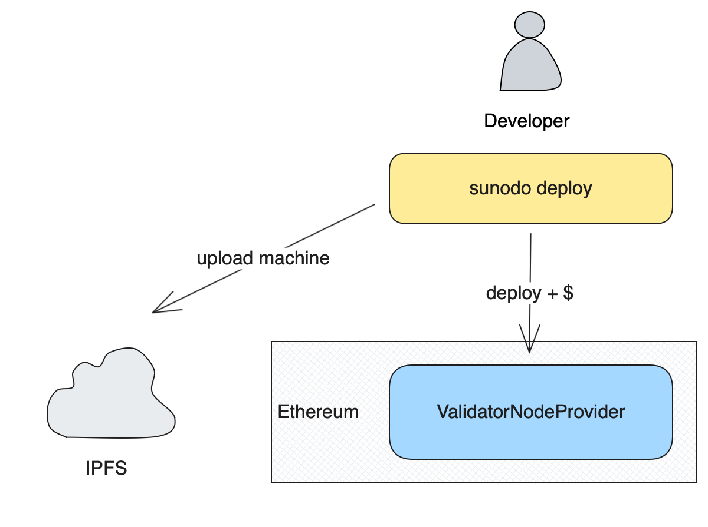

# Using a service provider

::: warning
This is still under development and will be available in a future release.
:::

This method of deployment allows the developer to select a service provider to run the application node on their behalf, freeing the developer of having to manage any infrastructure on his own.

The deployment of an application is done in two basic steps:

1. Publishing of the application Cartesi machine to the IPFS network;
2. Registration of the application on-chain;

The process is illustrated below:



::: info
If you also want to be the validator of your application, you must also run a validator node. Check the [becoming a validator](./validator.md) section for further details.
:::

## Cartesi machine publishing

The first step in the deployment process is to make the application Cartesi machine publicly available so the validator can download it and run the application node. Sunodo uses IPFS as a decentralized storage for the Cartesi machine.

The Sunodo CLI `deploy` command will package the Cartesi machine as a [CAR file](https://docs.ipfs.tech/concepts/how-ipfs-works/#how-ipfs-represents-and-addresses-data) and upload it to an IPFS node.

```shell
$ sunodo deploy
? Machine hash 0xaf03e4964f88560ebd3818d0661c51fb067383030e4c75f8d174ea53f74dba13
? IPFS node URL (http://127.0.0.1:5001)
? Machine ipfs location bafybeibzfaxjtoxsgzclj4xon32rmshfmveyj4ya6kpxch7utgqn7idrxi
? Open https://sunodo.io/deploy?cid=bafybeibzfaxjtoxsgzclj4xon32rmshfmveyj4ya6kpxch7utgqn7idrxi? (Y/n)
```

The IPFS node URL can be provided with the `--ipfs-url` option and will default to `http://127.0.0.1:5001` if there is an IFPS node running locally. For instructions on how to install and run an IPFS node check the [IPFS Desktop](https://docs.ipfs.tech/install/ipfs-desktop/) documentation.

After the machine is uploaded the `CID` address of the machine is printed. With the `CID` in hand the developer can proceed to the next section and register the application on-chain.

## Application registration

After obtaining the `CID` of the Cartesi machine the developer must register the application on-chain using a `ValidatorNodeProvider` smart contract.

Sunodo provides a web3 UI to interact with a `ValidatorNodeProvider` smart contract. The application can be accessed at [https://sunodo.io/deploy](https://sunodo.io/deploy), which is launched automatically at the end of the previous step.

The `deploy` function of a `ValidatorNodeProvider` smart contract requires four parameters:

-   `owner`: the owner of the deployed application, which has the power to switch the validator;
-   `templateHash`: the Cartesi machine template hash;
-   `location`: the IPFS CID of the Cartesi machine uploaded to IPFS;
-   `initialRunway`: the amount of time to pre-pay for application execution;

Depending on the `initialRunway` parameter the developer must `approve` a certain amount of tokens of the ERC-20 contract of the `ValidatorNodeProvider` to the `payee` of the `ValidatorNodeProvider`.

The amount of tokens can be calculated using the `cost` view function of the `ValidatorNodeProvider`. For further details check the [billing](./billing.md) section.
