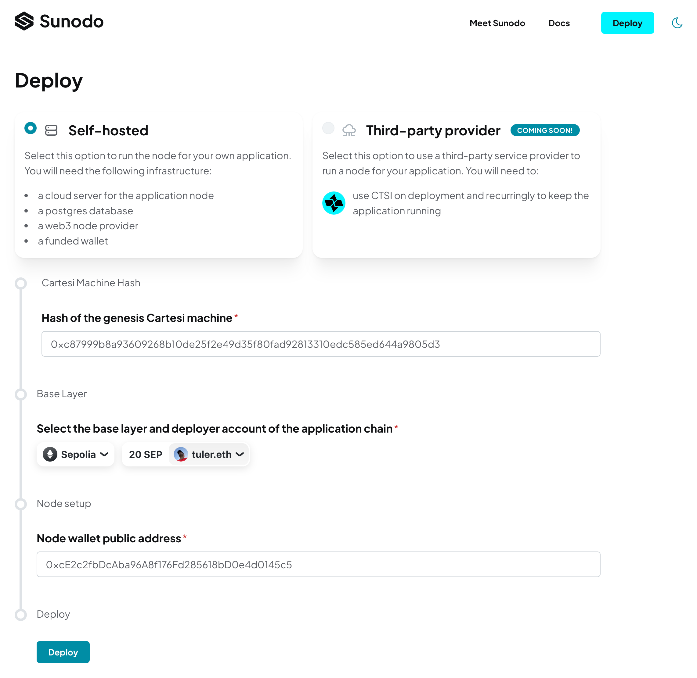
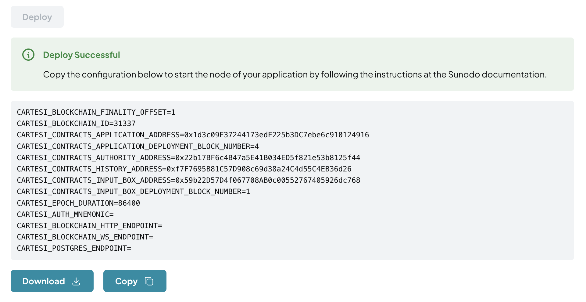

# Self-hosted deployment

This method of deployment allows the developer to run his own infrastructure to host the application node. The developer will need the following:

1. a server connected to the internet (i.e. cloud server);
2. a postgres database reachable from the server;
3. a web3 provider;
4. a wallet with funds of the [base layer of choice](./supported-networks.md).

## Deploying

The self-hosted deployment process can be initiated by the `sunodo deploy --hosting self-hosted` command.

That command will show the Cartesi machine hash and build a Docker image containing the Cartesi rollups node and the Cartesi machine:

```shell
$ sunodo deploy --hosting self-hosted
? Cartesi machine templateHash 0xc87999b8a93609268b10de25f2e49d35f80fad92813310edc585ed644a9805d3
? Application node Docker image sha256:5c355a9bddc92aa08987f395a257a0b32a51552c969eb161386e46f9380ea2ac
```

The image produced, in this example `sha256:5c355a...0ea2ac`, can be tagged and pushed to a Docker registry of choice, like Docker Hub, or any other private or public registry.

The next step is to deploy the smart contract for the application. The deploy command will redirect the developer to a web application, where he can use a wallet to deploy the required smart contracts.



## Wallet

The developer will need a wallet that will be used by the Cartesi rollups node to submit transactions to the base layer. This wallet should ideally be used exclusively for that purpose.

A new wallet can be created using a tool like [cast](https://book.getfoundry.sh/reference/cast/cast-wallet-new-mnemonic). A wallet managed by [AWS KMS](https://aws.amazon.com/blogs/database/part1-use-aws-kms-to-securely-manage-ethereum-accounts/) is also supported for an increased level of security.

::: warning
The deploy web application need the wallet PUBLIC ADDRESS only!
DON'T provide your mnemonic passphrase or private key.
:::

After the successful execution of the deployment transaction the developer is presented with information for the execution of the rollups node:



The configuration for the node is presented in a `.env` file format. It includes the addresses of the deployed smart contracts, as well as information of the base layer chain.

Three pieces are information are still missing though: the database connection string, the web3 provider URLs, and the wallet private key. The developer can download the configuration as an `.env` file and fill in the missing information.

The wallet private key, in the format of a mnemonic passphrase, must be configured as the `CARTESI_AUTH_MNEMONIC` environment variable.

::: warning
The mnemonic passphrase is a sensitive information. The developer should take care to keep it secure, like using a secret mechanism provided by the cloud provider of choice.
:::

## PostgreSQL database

The rollups node requires a PostgreSQL database to store information about the application state, which is served via the GraphQL API.

The developer can use any PostgreSQL database, either managed by a cloud provider, or run on his own infrastructure. The only configuration that must be provided is the connection string, which includes the database URL, username, password, and database name. If the developer decides to host his own database he must take care of security and maintenance, like regular backups and updates.

The connection string must be configured as an environment variable called `CARTESI_POSTGRES_ENDPOINT`.

::: warning
The database connection string, which includes the password, is a sensitive information. The developer should take care to keep it secure, like using a secret mechanism provided by the cloud provider of choice.
:::

The developer doesn't need to create the database schema, as the rollups node will do it automatically when it starts.

## Web3 provider

The rollups node need a connection to base layer through a standard JSON-RPC API endpoint. It requires both a HTTP endpoint as well as a WebSocket endpoint.

The developer can use any Web3 third-party provider, or of course run his own base layer node. The following are examples of service providers, in no particular order:

-   [Alchemy](https://www.alchemy.com)
-   [Infura](https://infura.io)
-   [Ankr](https://www.ankr.com)
-   [QuickNode](https://www.quicknode.com)
-   [GetBlock](https://getblock.io)

Each service has its own characteristics and pricing, and the developer should choose the one that best fits his needs. Any of them should work with the rollups node, but the first two are the most battle-tested.

The URLs for the HTTP and WebSocket endpoints must be configured as environment variables called `CARTESI_BLOCKCHAIN_HTTP_ENDPOINT` and `CARTESI_BLOCKCHAIN_WS_ENDPOINT`, respectively.

::: warning
The Web3 provider URLs can be sensitive information, if they are private URLs the developer is paying for. The developer should take care to keep it secure, like using a secret mechanism provided by the cloud provider of choice.
:::

## Cloud server

The developer will need a server to host the application node and run it 24/7. This server will expose a single port to the internet, so client applications, like front-ends, can consume the rollups node APIs through [GraphQL](https://docs.cartesi.io/cartesi-rollups/api/graphql/index/) or [Inspect](https://docs.cartesi.io/cartesi-rollups/api/inspect/inspect/) requests.

The server minimum requirements will depend on the expected usage of the application and on the specifications of the Cartesi machine in use, like its RAM size and total size. The developer will have to experiment with different configurations to find the best fit for his needs. We suggest starting with a minimum of 8GB of RAM, and scaling up vertically as needed.

The Cartesi rollups node is distributed as a Docker image, so the server will need to have Docker installed. Any popular cloud provider, like AWS, GCP, Azure, Digital Ocean, or Linode, is capable of running docker containers, either manually by spawing a server and running docker, or by using a managed container infrastructure like Kubernetes.

The developer can also use a service like [Fly.io](https://fly.io) to deploy the application node.

We will describe below two methods of running a rollups node, the first using Docker, which can be used as the basic information to use any cloud provider, and the second using [Fly.io](https://fly.io), a managed service for running Docker containers.

### Using Docker in any cloud provider

Assuming the developer completed the above requirements, and has a complete `.env` file, he can run the rollups node using the following command:

```shell
$ docker run --env-file <hash.env> -p 10000:10000 <image-id>
(...)
INFO http: listening at [::]:10000
(...)
INFO rollups-node: all services are ready
(...)
```

In the examples above the `<hash.env>` file is `0xc87999b8a93609268b10de25f2e49d35f80fad92813310edc585ed644a9805d3.env` and the `<image-id>` is `sha256:5c355a9bddc92aa08987f395a257a0b32a51552c969eb161386e46f9380ea2ac`.

The developer is free to use any managed container solution, like Kubernetes. The rollups node is just a single container, with a single exposed port, that must be accessible from the internet.

### Using fly.io

[Fly.io](https://fly.io) is platform as a service that allows developers to easily deploy applications packaged as Docker containers. The rollups node can be deployed to Fly.io using the following steps:

1. [Install the flyctl CLI](https://fly.io/docs/hands-on/install-flyctl/)
2. [Create an account and login](https://fly.io/docs/hands-on/sign-up-sign-in/)
3. Create an application (named with the hash of the machine):

```shell
$ fly app create $(sunodo hash --json | jq -r '.hash')
New app created: <hash>
```

4. Create the database and attach it to the node:

```shell
fly postgres create --initial-cluster-size 1 --name $(sunodo hash --json | jq -r '.hash')-database --vm-size shared-cpu-1x --volume-size 1
```

5. Attach database to the node application:

The previous step should have printed the connection string for the database. The developer can use it to configure the `CARTESI_POSTGRES_ENDPOINT` environment variable.

```shell
fly postgres attach $(sunodo hash --json | jq -r '.hash')-database -a $(sunodo hash --json | jq -r '.hash')
```

6. Create the `fly.toml` file:

```shell
cat <<EOF > fly.toml
app = "$(sunodo hash --json | jq -r '.hash')"

[http_service]
internal_port = 10000
force_https = true

[http_service.concurrency]
type = "requests"
soft_limit = 200
hard_limit = 250

[[http_service.checks]]
grace_period = "10s"
interval = "30s"
method = "GET"
timeout = "5s"
path = "/healthz"

[env]
CARTESI_HTTP_PORT = "10000"
CARTESI_HTTP_ADDRESS = "0.0.0.0"
CARTESI_BLOCKCHAIN_ID = "11155111"
CARTESI_BLOCKCHAIN_FINALITY_OFFSET = "1"
CARTESI_CONTRACTS_APPLICATION_ADDRESS = "0x5c7A258c4B833B31D51f105F8dEb5A5233156cf9"
CARTESI_CONTRACTS_APPLICATION_DEPLOYMENT_BLOCK_NUMBER = "5382002"
CARTESI_CONTRACTS_HISTORY_ADDRESS = "0x19558bc901C21f7C81a582999cA786B7018087d3"
CARTESI_CONTRACTS_AUTHORITY_ADDRESS = "0x5D1B6D937Dd1c75Ed1a681e12834cb629caae705"
CARTESI_CONTRACTS_INPUT_BOX_ADDRESS = "0x59b22D57D4f067708AB0c00552767405926dc768"
CARTESI_CONTRACTS_INPUT_BOX_DEPLOYMENT_BLOCK_NUMBER = "3963384"
CARTESI_EPOCH_DURATION = "86400"
EOF
```

7. Create the secrets:

```shell
fly secrets set CARTESI_BLOCKCHAIN_HTTP_ENDPOINT=<web3-provider-http-endpoint>
fly secrets set CARTESI_BLOCKCHAIN_WS_ENDPOINT=<web3-provider-ws-endpoint>
fly secrets set CARTESI_AUTH_MNEMONIC=<mnemonic>
fly secrets set CARTESI_POSTGRES_ENDPOINT=<connection_string>
```

8. Deploy the node:

Tag the image produced in the beginning of the process and push it to the Fly.io registry:

```shell
flyctl auth docker
docker image tag <image-id> registry.fly.io/$(sunodo hash --json | jq -r '.hash')
docker image push registry.fly.io/$(sunodo hash --json | jq -r '.hash)
```
