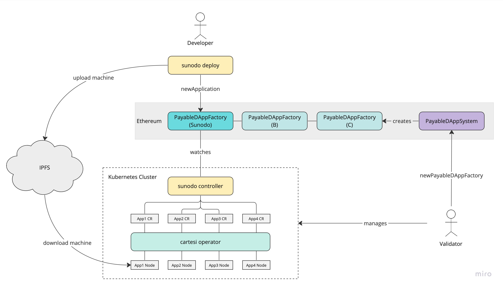
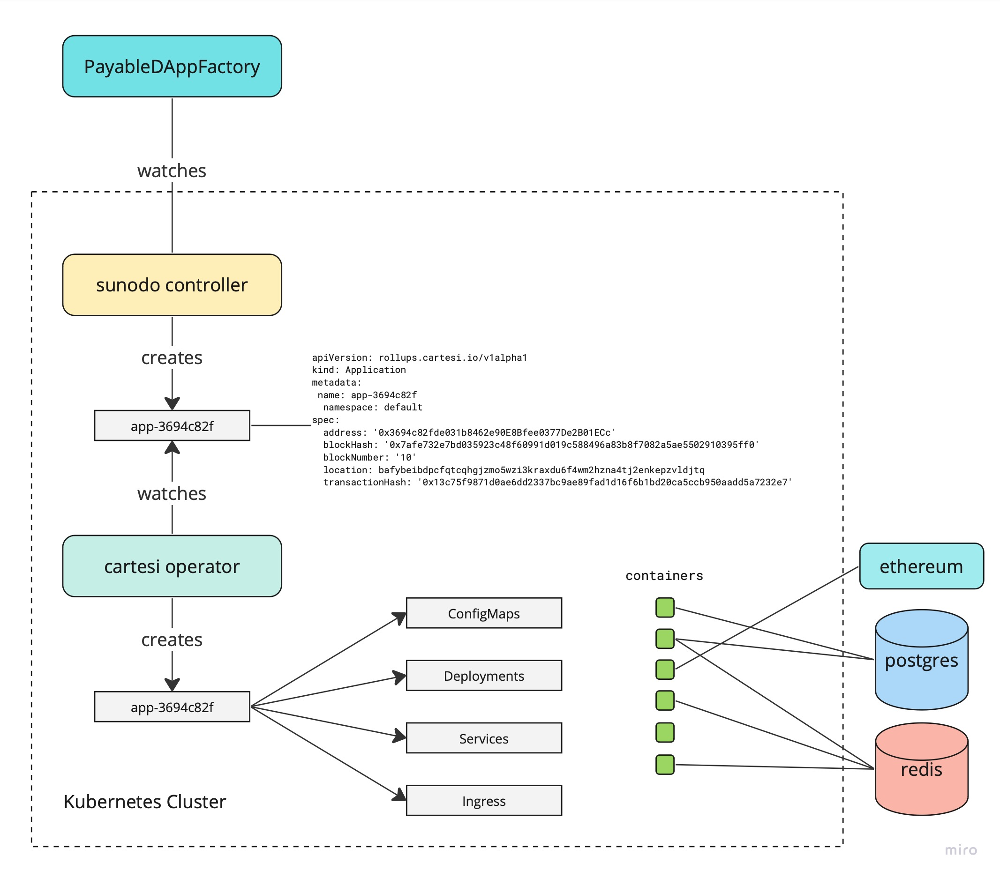

# Becoming a Validator

The following diagram illustrates the deployment system implemented by Sunodo.



Any person or institution who wants to become a validator must follow the steps below:

1. Create a `PayableDAppFactory` using the `PayableDAppSystem`.
2. Setup a Kubernetes Cluster for hosting application nodes.

## Creating a `PayableDAppFactory`

The deployment of an application is done through the `newInstance` method of a `PayableDAppFactory` smart contract. Each validator must have its own instance of `PayableDAppFactory`.

A new instance can be created by calling the `newPayableDAppFactory` method of the `PayableDAppSystem` smart contract, which requires three parameters:

-   `IERC20 token`: the address of the ERC-20 token to be used as payment for the application execution;
-   `IConsensus consensus`: the address of the consensus smart contract to be used by the application, typically an `Authority` contract;
-   `uint256 price`: the fixed price of the application execution, in tokens per second.

If the validator does not have an `Authority` contract yet one must be created using the `AuthorityFactory` smart contract.

## Setting up a Kubernetes Cluster

The validator must first setup a Kubernetes cluster. In theory, any cloud provider that has support for Kubernetes can be used, including [AWS EKS](https://aws.amazon.com/eks/), [Azure AKS](https://azure.microsoft.com/en-us/products/kubernetes-service), [Google GKE](https://cloud.google.com/kubernetes-engine), [DigitalOcean DOKS](https://www.digitalocean.com/products/kubernetes), [Vultr VKE](https://www.vultr.com/kubernetes/).

The only one that has been tested was AWS EKS. If you have any problems with a different one get in touch.

After setting up a cluster two applications must be installed:

-   Cartesi Operator
-   Sunodo Controller

The diagram below shows the Kubernetes cluster in detail.



## Installing Cartesi Operator

The Cartesi operator is responsible for launching Cartesi rollups nodes for appplications by watching a [Kubernetes CRD](https://kubernetes.io/docs/concepts/extend-kubernetes/api-extension/custom-resources/).

::: info
Add more information about operator installation
:::

## Setting up the Cartesi Operator

::: info
Add more information about database setup
:::

::: info
Add more information about redis setup
:::

::: info
Add more information about Ethereum setup
:::

::: info
Add more information about wallet setup
:::

## Installing Sunodo Controller

The Sunodo controller's job is to watch an specific `PayableDAppFactory` contract and create Kubernetes CRDs for each application that is deployed and properly funded.

```shell
sunodo controller
```

::: info
Add more information about controller installation
:::

## Setting up the Controller

::: info
Add more information about setting up the controller
:::
