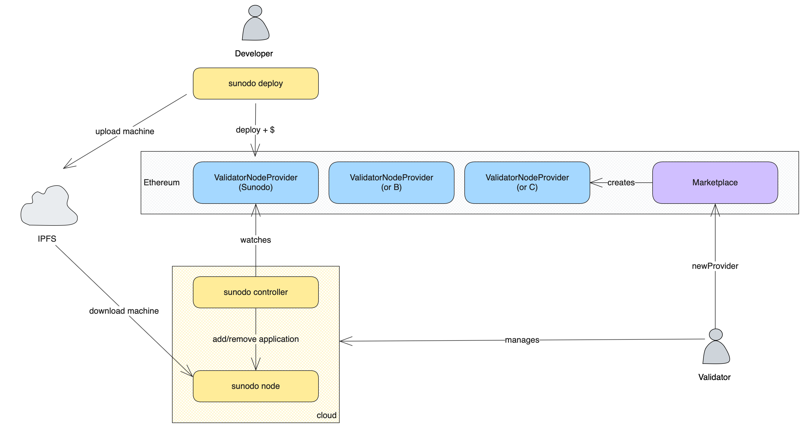

# Becoming a Validator

::: warning
This is still under development and will be available in a future release.
:::

The following diagram illustrates the deployment system implemented by Sunodo.

Any person or institution who wants to become a validator must follow the steps below:

1. Create a `ValidatorNodeProvider` using the `Marketplace`.
2. Setup a Sunodo node.

## Creating a `ValidatorNodeProvider`

The deployment of an application is done through the `deploy` function of a `ValidatorNodeProvider` smart contract. Each validator must have its own instance of `ValidatorNodeProvider`.

A new instance can be created by calling the `newValidatorNodeProvider` function of the `Marketplace` smart contract, which requires four parameters:

-   `IConsensus consensus`: the address of the consensus smart contract to be used by the application, typically an `Authority` contract;
-   `IERC20 token`: the address of the ERC-20 token to be used as payment for the application execution;
-   `address payee`: the address that will receive the payments;
-   `uint256 price`: the fixed price of the application execution, in tokens per second.

If the validator does not have an `Authority` contract yet one must be created using the Cartesi `AuthorityHistoryPairFactory` smart contract.

## Setting up the Sunodo node

The Sunodo node is a Cartesi node that is capable of managing multiple applications in the same node.

::: info
Add more information about the Sunodo node
:::

::: info
Add more information about database setup
:::

::: info
Add more information about redis setup
:::

::: info
Add more information about Ethereum setup
:::

::: info
Add more information about wallet setup
:::

## Setting up the Controller

The Sunodo controller's job is to watch an specific `ValidatorNodeProvider` contract and add or remove applications from a Sunodo node based on funding information.

::: info
Add more information about the controller
:::
