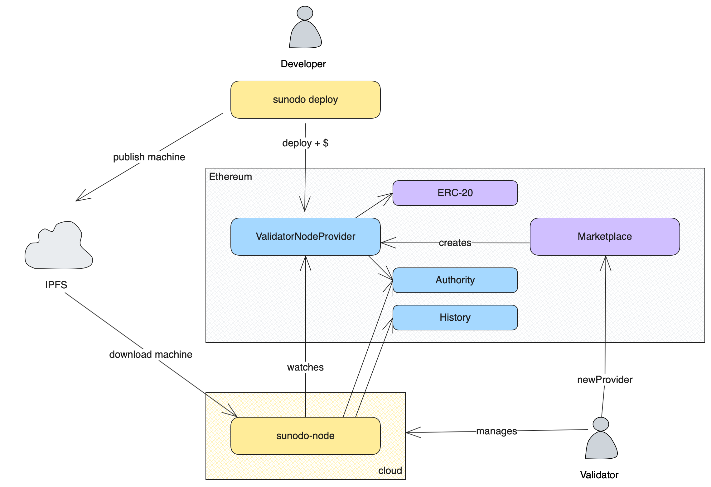

# Becoming a Validator

::: warning
This is still under development and will be available in a future release.
:::

The following diagram illustrates the deployment system implemented by Sunodo.



Any person or institution who wants to become a validator must follow the steps below:

1. Install the `sunodo-node` CLI;
2. Create an [Authority](https://github.com/cartesi/rollups-contracts/blob/v1.2.0/onchain/rollups/contracts/consensus/authority/Authority.sol) and [History](https://github.com/cartesi/rollups-contracts/blob/v1.2.0/onchain/rollups/contracts/history/History.sol) contract on the base layer using the [AuthorityHistoryPairFactory](https://github.com/cartesi/rollups-contracts/blob/v1.2.0/onchain/rollups/contracts/consensus/authority/AuthorityHistoryPairFactory.sol);
3. Create a [ValidatorNodeProvider](https://github.com/sunodo/sunodo/blob/%40sunodo/contracts%400.4.0/packages/contracts/contracts/provider/NodeProvider.sol) on the base layer using the [Marketplace](https://github.com/sunodo/sunodo/blob/%40sunodo/contracts%400.4.0/packages/contracts/contracts/marketplace/Marketplace.sol);
4. Setup a Sunodo node.

## Installing the `sunodo-node` CLI

Sunodo provides a separate CLI tool targeted to validators, which provides commands for the tasks described in this section. The tool can be install using [homebrew](https://brew.sh) or [npm](https://www.npmjs.com).

::: code-group

```shell [brew]
brew install sunodo/tap/sunodo-node
```

```shell [npm]
npm install -g @sunodo/node
```

:::

## Creating an `Authority` and `History`

The `Authority` is the Cartesi smart contract that implements the consensus model of the application validation. The Cartesi node sends the application's state to the `Authority` contract on every epoch (which is configurable).

The `History` contract is responsible for storing the claims of each application, is connected to the `Authority` contract.

The `sunodo-node` CLI provides a command to create a new `Authority` contract:

```shell
sunodo-node create authority
    --chain-id=<option>
    --rpc-url=<value>
    --private-key=<value>
    --mnemonic-passphrase=<value>
    --mnemonic-index=<value>
    --owner=<owner>
```

The `owner` option must specify the address of the account that will own the `Authority` and `History` contracts and must be the same account address that will be configured in the Sunodo node.

## Creating a `ValidatorNodeProvider`

The deployment of an application is done through the `deploy` function of a `ValidatorNodeProvider` smart contract. Each validator must have its own instance of `ValidatorNodeProvider`.

A new instance can be create using the `create provider` command of the `sunodo-node` CLI:

```shell
sunodo-node create provider
    --chain-id=<option>
    --rpc-url=<value>
    --private-key=<value>
    --mnemonic-passphrase=<value>
    --mnemonic-index=<value>
    --validator=true|false
    --consensus=<value>
    --token=<value>
    --payee=<value>
    --price=<value>
```

The `validator` option flag indicates if the provider is a validator node provider or only a reader node provider. The default value is `true`, which means that a `consensus` value must also be provided. The value of the `consensus` option must be the address of the `Authority` contract created in the previous step.

The `token`, `payee` and `price` options are related to the [billing](./billing) of the provider. The `token` must be the address of the ERC-20 token to be used as payment for the application execution, the `payee` must be the address that will receive the payments and the `price` must be the amount of tokens charged per unit of time (second).

:::info
A token is required but if you don't want to charge anything for the service you can specify any token (i.e. USDC) and specify a zero price.
:::

### Setting up provider ENS

The `ValidatorNodeProvider` contract supports [ENS](https://app.ens.domains) integration, allowing the contract owner to set a name for the provider address by calling the `setName` function using the owner account.

ENS also supports [text records](https://docs.ens.domains/ens-improvement-proposals/ensip-5-text-records), like `email` or `url`. These records can help the UI and interaction with the provider in a decentralized fashion. One text record of particular importance is the key `io.sunodo.baseUrl`, which is used to resolve the address of a node created for an application. The value of the `io.sunodo.baseUrl` text record key can use the following variables to resolve the node URL:

<!-- markdownlint-disable MD033 -->

-   <span v-pre>**{{application_address}}**</span>: the application contract address
-   <span v-pre>**{{chain_id}}**</span>: the EIP-155 id of the selected chain
-   <span v-pre>**{{chain_name}}**</span>: the name of the selected chain (mainnet, sepolia, arbitrum, arbitrum-sepolia, optimism, optimism-sepolia)
-   <span v-pre>**{{provider_address}}**</span>: address of the provider

As an example a record value like <span v-pre>`https://{{chain_name}}.apps.sunodo.io/{{application_address}}`</span> would resolve the node URL to `https://sepolia.apps.sunodo.io/0x0974CC873dF893B302f6be7ecf4F9D4b1A15C366` for an application deployed at `0x0974CC873dF893B302f6be7ecf4F9D4b1A15C366` in the `sepolia` chain.

<!-- markdownlint-enable MD033 -->

## Setting up the Sunodo validator node

The Sunodo validator node's job is to watch a specific `ValidatorNodeProvider` contract and execute application nodes based on the billing information.

The `sunodo-node` CLI provides to `start` command to execute a node:

```shell
sunodo-node start
    --chain-id=<option> (env: CARTESI_BLOCKCHAIN_ID)
    --rpc-url=<value> (env: CARTESI_BLOCKCHAIN_HTTP_ENDPOINT)
    --ws-url=<value> (env: CARTESI_BLOCKCHAIN_WS_ENDPOINT)
    --private-key=<value>
    --mnemonic-passphrase=<value> (env: CARTESI_AUTH_MNEMONIC)
    --mnemonic-index=<value>
    --kms-key-id=<value>
    --validator=true|false
    --verbose=true|false (env: CARTESI_LOG_LEVEL)
    --embedded-database=true|false
    --epoch-duration=<value> (env: CARTESI_EPOCH_DURATION)
    --postgres-url=<value> (env: CARTESI_POSTGRES_ENDPOINT)
    --snapshot-dir=<value> (env: CARTESI_SNAPSHOT_DIR)
    --consensus=<value> (env: CARTESI_CONTRACTS_AUTHORITY_ADDRESS)
    --history=<value> (env: CARTESI_CONTRACTS_HISTORY_ADDRESS)
    --provider=<value> (env: SUNODO_CONTRACTS_PROVIDER)
```

The node requires the following external components:

-   an ethereum provider for the selected base layer;
-   a postgres database;
-   the wallet that owns the `Authority` contract created in the previous section;

### Ethereum provider

The node requires a connection to the selected [base layer](./supported-networks.md) through a JSON-RPC provider.
The provider must support both HTTP and WebSocket.

The user can run his base layer node, or choose a third-party provider from the non-exaustive list below:

-   [Alchemy](http://alchemy.com)
-   [Infura](https://infura.io)
-   [Chainstack](http://chainstack.com)
-   [GetBlock](https://getblock.io)

### Database

The node uses a [postgres](http://postgresql.org) database to store application state (inputs and outputs), and serves those over a GraphQL API. The user must [setup a database server](https://www.postgresql.org/download/), or use a third-party managed database provider.

The database credentials provided to the Sunodo node must have permission to create new databases, because each application will have its own independent database. The schema of the application database does not need to be created beforehand because it's dynamically created by the Sunodo node.

The `sunodo-node start` command provides the option `--embedded-database` that will spin up a postgres instance. This option must only be used for test purposes, because persistence of data is turned off, there is no backup mechanism, and the security of the database access is not production-grade.

### Wallet

Sunodo validator node interacts with the `Authority` smart contract created above to submit claims of the application state once every epoch. To do that it needs to be configured with the base layer wallet that is the owner of the `Authority` contract.

::: warning
A wallet must be used by a single Sunodo node. Do not share the wallet with other applications or other Sunodo nodes as the nonce management may cause issues.
:::

The first and less safe way is to specify a mnemonic passphrase as the `--mnemonic-passphrase` command option and optionally the `--mnemonic-index` which defaults to zero. The environment variable `CARTESI_AUTH_MNEMONIC` can also be used instead.

A much safer way to specify the wallet is using [AWS KMS](https://docs.aws.amazon.com/kms/) as the private key manager. This is the recommended method for production applications, even if the node is not running inside AWS.

Refer to [this blog post](https://aws.amazon.com/blogs/database/part1-use-aws-kms-to-securely-manage-ethereum-accounts/) that explains in detail how to create an AWS KMS key for Ethereum accounts. Once you create a key you can specify the KMS key id using the `--kms-key-id` command line option and provide the appropriate AWS credentials that have access to use the key.

:::info
An AWS KMS key is much safer because the private key itself is not exposed to the Sunodo node application. What is exposed is the access to **use** the key, which can be revoked by a master AWS account. On the other hand, compromising the private key itself has no turning point.
:::
