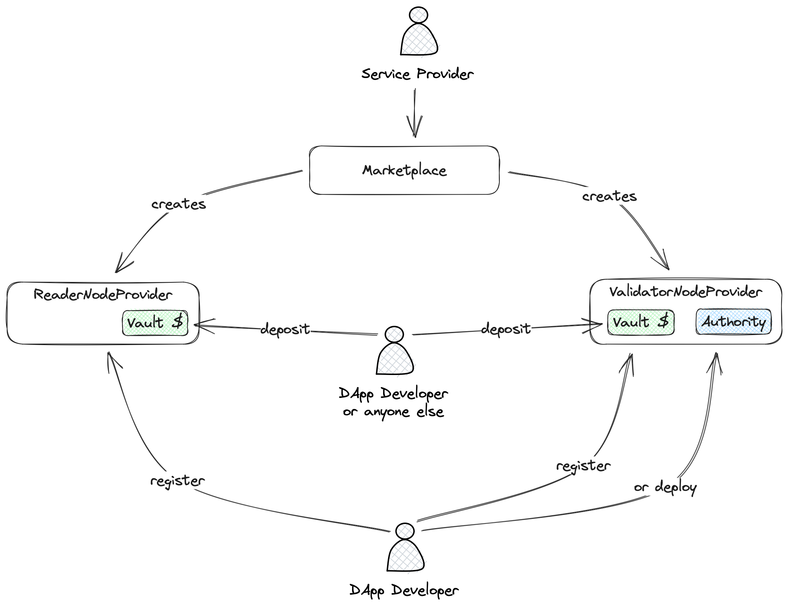

# Contracts

The [Cartesi Node](https://github.com/cartesi/rollups-node) provided by the Cartesi team allows anyone to run a node for a specific application assuming they have the Cartesi machine initial snapshot in hand, and have the financial incentives to run it, which typically has computational and storage costs.

The goal of the smart contracts in this package is to support an incentivized and decentralized way of delegating the execution of Cartesi Nodes for applications to third-party service providers.

Two protocols are defined to support this goal: `IMachineProtocol` and `IFinancialProtocol`.

## Protocols

### IMachineProtocol

```solidity
interface IMachineProtocol {
    event MachineLocation(address indexed dapp, string location);
}
```

This allows the on-chain specification of where the service provider can download the Cartesi machine snapshot from. The protocol does not enforce the method used for the location, it can be a public URL, an IPFS CID, a local path, etc.

### IFinancialProtocol

```solidity
interface IFinancialProtocol {
    event FinancialRunway(address indexed dapp, uint256 until);
}
```

This protocol allows a service provider to know how long an application has enough funds to run. Of course it is a choice of the service provider off-chain node manager to decide which smart contract implementation to watch for `IFinancialProtocol` events.

## Implementation

The two protocols described above are implemented by two concrete Smart Contracts: `ReaderNodeProvider` and `ValidatorNodeProvider`.



### ReaderNodeProvider

The `ReaderNodeProvider` contract is responsible for the implementation of the `IMachineProtocol` protocol and inherits from a `Vault` contract which implements the `IFinancialProtocol` protocol.

Anyone can call the `register` method of the `ReaderNodeProvider` contract to register a new application. The caller must provide the Cartesi machine snapshot location so the service provider can download it and run a node for the application. If the service provider can't find the machine, or if the machine's hash is not the one specified during the application deployment, the node will fail to run.

### ValidatorNodeProvider

The `ValidatorNodeProvider` contract builds on top of the `ReaderNodeProvider` and adds the capability of deploying applications through the provider.

A `ValidatorNodeProvider` is attached to an `IConsensus` and only accepts registrations of applications that has the same consensus as the one it is attached to.

Developers can use the `ValidatorNodeProvider` to deploy their application by calling the `deploy` method and specifying who is the application owner, the hash of the Cartesi machine snapshot, and the location of the Cartesi machine snapshot. The `ValidatorNodeProvider` is already attached to a consensus, so the developer does not need to specify it.

### Vault

The `Vault` contract is responsible for the implementation of the `IFinancialProtocol` protocol and implements a simple model based on an ERC-20 token and a fixed price per unit of time.

### Marketplace

Service providers can use the `Marketplace` contract to register their services and developers can use it to find service providers for their applications. It emits two events: `ValidatorNodeProviderCreated` and `ReaderNodeProviderCreated`, so indexing solutions can be used to build a database of service providers and display them in a user friendly way.
